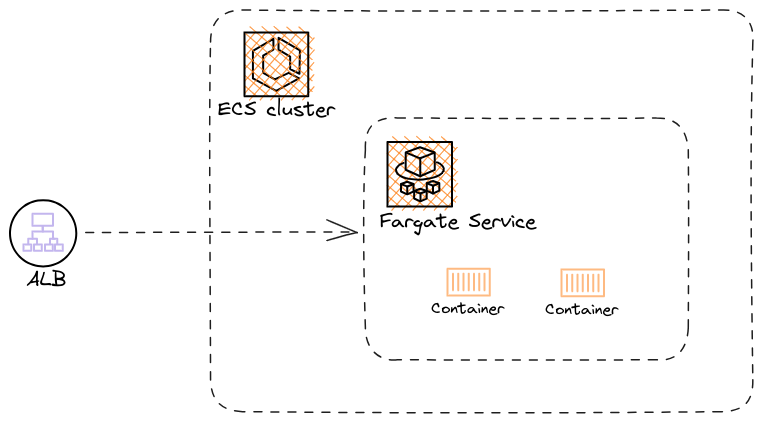

# Setup Simple ECS cluster
The Terraform code help to setup a ECS cluster running on the default public VPC.
Steps:
1. Create ECS cluster and Task definition
2. Create Security Group + Application Load Balancer
3. Setup ECS service, connect to ALB target group and allow access only from ALB

  